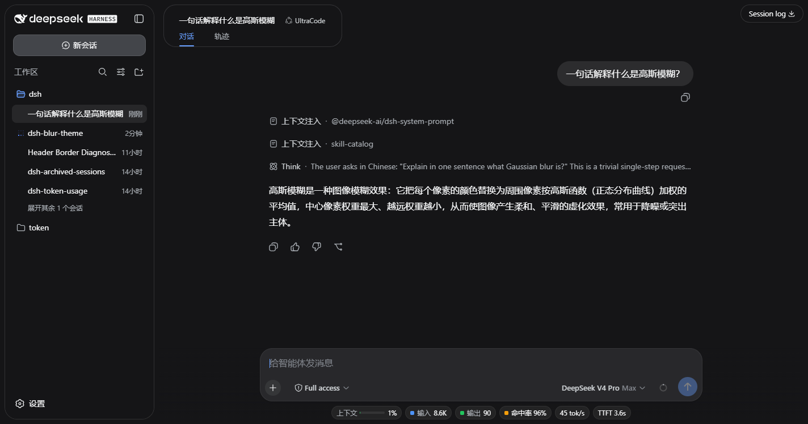
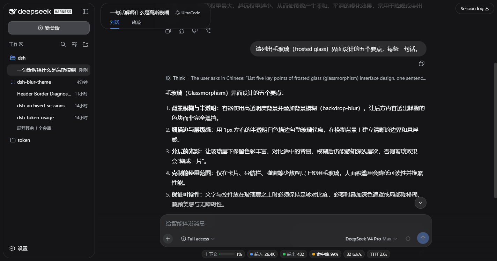

<div align="center">

# dsh-gaussian-blur

**为 DeepSeek Harness Web UI 带来毛玻璃质感主题。**

[](https://github.com/hashdiana/dsh-blur-theme/stargazers)
[](https://github.com/hashdiana/dsh-blur-theme/blob/main/LICENSE)
[](https://github.com/topics/dsh-plugin)

🌐 [English](README.md) · 中文

</div>

原版 Web UI 的每个栏都是不透明的、每条边都是硬切的。**dsh-gaussian-blur 把它重新打磨成一套玻璃主题**：侧边栏变成圆角悬浮卡片，会话头部变成磨砂悬浮栏、消息从它下方一直滚到浏览器最上边缘才消失，输入带悬浮在内容之上、内容可以一直延伸到窗口最底边。

🎯 悬浮栏应该浮在内容之上——而不是把内容拦腰截断。

## 截图

<p align="center">
  
</p>
<p align="center"><em>玻璃质感会话视图：圆角侧边栏卡片、磨砂头部、悬浮输入卡片。</em></p>

<p align="center">
  
</p>
<p align="center"><em>滚动中：消息在窗口上下边缘自然融化，而不是在硬边栏处突然消失。</em></p>

<details>
<summary><b>目录</b></summary>

- [截图](#截图)
- [亮点](#亮点)
- [改动一览](#改动一览)
- [安装](#安装)
- [卸载 / 停用](#卸载--停用)
- [构建与开发](#构建与开发)
- [实现原理](#实现原理)
- [License](#license)

</details>

## 亮点

- **侧边栏卡片化** —— 侧边栏整体是一张圆角卡片（22px 圆角、细描边、柔和投影、主题底色），左右留白对称；收起后的窄栏变成贴边的圆角胶囊。
- **磨砂头部卡** —— 会话栏（会话名、agent 预设、标签页）是一张半透明 + 高斯模糊的悬浮卡片。
- **内容在窗口边缘融化** —— 消息从磨砂头部下方一直滚到浏览器**最上边缘**、在那里消失；向下则延伸到**最底边**、沉入输入带。不会在栏边被硬切。
- **悬浮输入带** —— 输入卡片是整面均匀的磨砂玻璃（无渐变、无光晕），悬浮在滚动区之上。
- **纯色渐隐、无模糊伪影** —— 边缘渐隐是纯色渐变，渐隐层上没有任何 `backdrop-filter`，因此没有亚像素色散。
- **实时模糊滑块** —— 设置 → 常规 →「悬浮卡片高斯模糊」（0–100；0 = 关闭，100 = 30px，默认 60 = 18px）同时调节**两张**玻璃卡，实时预览并持久化。
- **主题自适应、双语** —— 只用 `--dsw-*` 令牌（明暗主题自动跟随），内置中英文。

## 改动一览

| 区域 | 效果 |
|---|---|
| 侧边栏列 | 圆角悬浮卡片，细描边 + 投影，底色与头部卡一致 |
| 侧边栏树边缘 | 可滚动时上下各 40px 纯色渐隐，替换内置的底部渐隐 |
| 会话头部 | 半透明模糊悬浮卡；工具浮贴钉在视口右上角 |
| 对话区上边缘 | 内容穿过磨砂头部一直滚到浏览器顶边，实色贴顶边的渐隐让它恰好在顶边消失 |
| 对话区下边缘 | 内容延伸到浏览器底边，实色贴底边的渐隐让它向上融进输入带 |
| 输入卡片 | 整面均匀磨砂玻璃（模糊 + 饱和 + 半透明底），无光晕 |
| 设置 | 常规设置新增「悬浮卡片高斯模糊」滑块行，持久化于浏览器本地存储 |

## 安装

**从 GitHub（推荐）：**

```sh
npx -p @deepseek-ai/dsh dsh plugin --profile web add github:hashdiana/dsh-blur-theme
```

**从本地目录：**

```sh
npx -p @deepseek-ai/dsh dsh plugin --profile web add <本仓库路径>
```

然后重启目标 profile：

```sh
dsh web
```

> Git 分发携带已构建的 `lib/`（见「构建与开发」），安装时不需要执行任何构建脚本。插件集合变化需要重启；之后仅 client bundle 内容的更新刷新页面即可生效。

## 卸载 / 停用

不卸载、暂时停用 —— 在 `$DSH_HOME/profiles/web/cordis.patch.yml` 中加入：

```yaml
- id: dsh-gaussian-blur
  disabled: true
```

重启 `dsh web`，界面恢复原版；删除这几行即重新启用。

## 构建与开发

```sh
pnpm install
pnpm typecheck   # tsc -b
pnpm build       # tsc -b + tsdown → lib/index.js (host) + lib/client.js (browser)
pnpm test        # vitest：enhancer 标记/遍历、设置行、插件契约、bundle 纯度
```

client bundle 输出为 `window.__ModuleLoader__.load({ id, factory })`；CSS Modules 由 lightningcss 哈希并以 `<style data-plugin="dsh-gaussian-blur">` 注入。**请提交 `lib/`** —— Git 安装消费的是构建产物，不是 `src/`。

## 实现原理

- **纯 client 插件** —— host 半边注册插件的设置命名空间 schema（前向兼容：目前 Web 设置通道只对框架白名单内的命名空间开放，所以浏览器半边把偏好持久化在浏览器本地存储）；视觉面通过 `exports["./client"]` 下发。
- **只锚定稳定钩子** —— 锚点全部来自官方 UI 的稳定 `data-*` 属性（`data-shell-overlay`、`data-conversation-scroll`、`data-composer-seat` / `data-composer-card`、`div[data-phase]`、`[role="tree"]`）；enhancer 打上自己的 `data-gb-*` 标记（自动穿透 slot 的 `display: contents` 包裹层），一张样式表完成全部视觉效果，不耦合任何哈希类名。
- **body 级渐隐层** —— 边缘渐隐是挂在 `document.body` 上的 `position: fixed` 覆盖层（React 不会触碰 body 子节点），纯实色→透明渐变，`pointer-events: none`，`z-index: 5` 低于所有悬浮控件。
- **磨砂却不拖坏浮贴** —— 头部卡的 `backdrop-filter` 放在 `::before` 图层上；若直接放在卡片元素上，Chromium 会把它变成右侧 fixed 浮贴的包含块，把浮贴拽进卡片里。
- **幂等 + 自愈** —— 标记遍历由防抖的 MutationObserver 加滚动/缩放事件持续重跑；卸载（HMR/关闭）时移除全部标记与覆盖层、恢复内置侧边栏渐隐、断开所有观察器。

## License

[MIT](LICENSE)
